# Flash Flood — Deterministic Engine Decision Flow

How `engine/hazards/flash_flood.py` turns a `HazardInputs` feature vector into a
`Tier` posture. Every cut point shown is a **key read from
`data/thresholds/flash_flood.yaml`** (v1.3.0), never a hard-coded number (FR-20a) —
the values annotated below are the current config, not the logic.

**The governing rule: signals only ever RAISE the posture.** The evaluator carries a
running `tier` seeded at `MINIMAL` and applies `max()` at every stage. A weak signal
(a Flood Advisory) can never suppress a strong one (a 70 % ensemble probability).

Tiers are an ordered `IntEnum`: `MINIMAL(0) < ELEVATED(1) < HIGH(2) < EXTREME(3)`.

---

## The flow

```mermaid
flowchart TD
    START([HazardInputs + flash_flood.yaml]) --> SEED["tier = MINIMAL<br/>drivers = [] · notes = []"]

    SEED --> S1

    %% ---------- Stage 1: active NWS products ----------
    subgraph S1 ["① Active NWS products — near-term authoritative anchor"]
        direction TB
        AVAIL{"nws_products_available?"}
        AVAIL -->|"No"| GAP1["NOTE · DATA GAP:<br/>alert check unavailable —<br/>products unverified, not clear"]
        AVAIL -->|"Yes"| PROD
        GAP1 --> PROD
        PROD["For EACH active product,<br/>take max of its configured tier"]
        PROD --> P1["Flash Flood Warning → EXTREME"]
        PROD --> P2["Flash Flood Watch → HIGH"]
        PROD --> P3["Flood Warning → HIGH"]
        PROD --> P4["Flood Advisory → ELEVATED"]
        PROD --> P5["Flood Watch → ELEVATED"]
    end

    S1 --> S2

    %% ---------- Stage 2: GEFS planning horizon ----------
    subgraph S2 ["② GEFS member-exceedance over the UPSTREAM WATERSHED — planning horizon"]
        direction TB
        G0{"gefs_p_precip<br/>available?"}
        G0 -->|"None"| GGAP["MINIMAL + DRIVER · DATA GAP:<br/>no ensemble signal —<br/>'unassessed, not low'"]
        G0 -->|"value p"| G1{"p ≥ high_min<br/>(60 %)?"}
        G1 -->|"Yes"| GHIGH["candidate = HIGH"]
        G1 -->|"No"| G2{"p ≥ elevated_min<br/>(20 %)?"}
        G2 -->|"No"| GMIN["candidate = MINIMAL<br/>'dry upstream'"]
        G2 -->|"Yes"| G3{"measurable_precip<br/>tri-state?"}
        G3 -->|"True"| GELEV["candidate = ELEVATED"]
        G3 -->|"None = UNKNOWN"| GELEVC["candidate = ELEVATED<br/>band applied conservatively<br/>(unknown ≠ dry)"]
        G3 -->|"False"| GMIN2["candidate = MINIMAL<br/>band met but no forecast precip"]
    end

    S2 --> MAX2["tier = max(tier, GEFS candidate)"]
    MAX2 --> S3

    %% ---------- Stage 3: AFD ----------
    subgraph S3 ["③ AFD forecaster discussion — coarse positive signal"]
        direction TB
        A0{"afd_flood_mention?"}
        A0 -->|"No"| ASKIP["no change"]
        A0 -->|"Yes"| A1{"afd_flood_mention_tier<br/>(ELEVATED) > tier?"}
        A1 -->|"Yes"| AFLOOR["tier = ELEVATED (floor raised)"]
        A1 -->|"No"| ACONC["DRIVER: 'AFD concurs'<br/>tier unchanged"]
    end

    S3 --> S4

    %% ---------- Stage 4: REFS overlay ----------
    subgraph S4 ["④ REFS ~3 km neighborhood overlay — same-day only (~6–36 h)"]
        direction TB
        H0{"refs_p_precip<br/>in range?"}
        H0 -->|"None = out of range"| HSKIP["skipped entirely"]
        H0 -->|"value hp"| H1{"hp ≥ high_min<br/>(40 %)?"}
        H1 -->|"Yes"| HHIGH["refs_tier = HIGH"]
        H1 -->|"No"| H2{"hp ≥ elevated_min<br/>(10 %)?"}
        H2 -->|"Yes"| HELEV["refs_tier = ELEVATED"]
        H2 -->|"No"| HMIN["refs_tier = MINIMAL"]
    end

    S4 --> MAX4["tier = max(tier, refs_tier)<br/>FR-19: take the HIGHER of GEFS / REFS"]
    MAX4 --> S5

    %% ---------- Stage 5: modifiers ----------
    subgraph S5 ["⑤ Modifiers"]
        direction TB
        M0{"antecedent_precip_24_72h<br/>AND tier ≥ ELEVATED?"}
        M0 -->|"Yes"| MBUMP["BUMP one tier<br/>(capped at EXTREME)<br/>saturated soils"]
        M0 -->|"No"| MSKIP["no bump — a saturated basin<br/>with a dry forecast stays MINIMAL"]
        MBUMP --> SLOT
        MSKIP --> SLOT
        SLOT{"is_slot?"}
        SLOT -->|"No"| SDONE["no fallback"]
        SLOT -->|"Yes"| SRATE{"convective_rate_in_per_hr<br/>available?"}
        SRATE -->|"None"| SGAP["NOTE · DATA GAP:<br/>slot fallback could not<br/>be evaluated"]
        SRATE -->|"value r"| SR1{"r > slot_rate_in_per_hr<br/>(0.50 in/hr)?"}
        SR1 -->|"Yes"| SFLOOR["FLOOR tier at HIGH<br/>slots flood at low totals —<br/>intentionally conservative"]
        SR1 -->|"No"| SDONE2["no fallback"]
    end

    S5 --> OUT

    OUT["return (tier, drivers, notes)"] --> T0{"final tier"}
    T0 --> TMIN(["MINIMAL"])
    T0 --> TELE(["ELEVATED"])
    T0 --> THI(["HIGH"])
    T0 --> TEXT(["EXTREME"])

    classDef gap fill:#4a3a1a,stroke:#c9922e,color:#f0e6d2
    classDef raise fill:#4a2a2a,stroke:#c95f5f,color:#f5dede
    classDef posture fill:#1e2d3d,stroke:#5b9bd5,color:#e6f0fa
    class GAP1,GGAP,SGAP,GELEVC gap
    class SFLOOR,MBUMP,AFLOOR raise
    class TMIN,TELE,THI,TEXT posture
```

---

## What triggers each posture

| Posture | Sufficient triggers (any one) |
|---|---|
| **EXTREME** | Active **Flash Flood Warning**. — or — any HIGH trigger below **plus antecedent wetness** (24–72 h prior rain bumps HIGH → EXTREME). |
| **HIGH** | Active **Flash Flood Watch**. — or — active **Flood Warning**. — or — **GEFS P(precip) ≥ 60 %** over the upstream watershed. — or — **REFS neighborhood P(QPF) ≥ 40 %** in the same-day window. — or — **slot fallback**: `is_slot` and forecast convective rate **> 0.50 in/hr**. — or — an ELEVATED trigger **plus antecedent wetness**. |
| **ELEVATED** | Active **Flood Advisory** or **Flood Watch**. — or — **GEFS P(precip) 20–60 %** *and* `measurable_precip` is True **or unknown**. — or — **REFS P(QPF) 10–40 %**. — or — **AFD** discusses excessive rainfall / flooding potential. |
| **MINIMAL** | GEFS P(precip) < 20 %. — or — GEFS in the 20–60 % band but `measurable_precip` is explicitly **False** (dry upstream). — or — **no ensemble signal at all** — reported as an explicit *"unassessed, not low"* data gap, **not** as a low-risk finding. |

---

## Five things the flowchart is actually saying

1. **Every stage is a `max()`, never an assignment.** The near-term product anchor,
   the global ensemble, the AFD signal, and the high-resolution overlay are four
   independent candidate tiers. The output is the highest. This is FR-19, and it is
   why a Flood Advisory sitting under a 70 % GEFS signal still yields HIGH.

2. **The two ensembles are not interchangeable, and their cut points are not
   comparable.** GEFS is global, coarse, 6 h accumulation buckets — 60 % / 20 %. REFS
   is ~3 km neighborhood probability over a 15-member basis — 40 % / 10 %. They read
   different physical quantities, so they get separate bands and separate branches.
   REFS is evaluated *only* inside its ~6–36 h window and is simply skipped outside it.

3. **Missing data is never quietly benign.** Three distinct gap paths appear in the
   diagram, and all three emit visible text rather than a silent MINIMAL: the alert
   check being down, the ensemble being unavailable ("unassessed, not low"), and the
   convective-rate feed being down so the slot fallback could not run. Separately,
   `measurable_precip` is **tri-state** — `None` (unknown) applies the Elevated band
   conservatively, while only an explicit `False` gates it off.

4. **Antecedent wetness is a multiplier, not a signal.** It only fires when the tier
   is *already* ≥ ELEVATED. A saturated basin under a dry forecast is still MINIMAL
   flood risk — soil moisture with no incoming rain is not a flash flood.

5. **The slot fallback is a floor, not a candidate.** It cannot lower anything; it
   only guarantees at least HIGH when a slot canyon meets a rainfall-rate trigger that
   would be unremarkable in open terrain. It is flagged in the output as intentionally
   conservative so the user knows it fired.

---

## Downstream of the tier

The evaluator returns `(tier, drivers, notes)`. Two things happen next, outside this
file:

- **Confidence** is assigned separately (`engine/confidence.py`) from ensemble member
  support and source agreement. Flash flood confidence is **capped at Moderate when the
  upstream trace is incomplete**, and floored at **Low** when the hazard's primary
  driver was unavailable (`confidence.yaml` `missing_primary_confidence`). A HIGH tier
  at Low confidence is a meaningfully different briefing than a HIGH at High confidence,
  and the UI shows both.
- **Phase evaluation.** Flash flood is deliberately **left window-conservative** while
  heat, cold, and lightning are sliced per phase. Upstream rain arrives in-slot on a
  travel-time lag, so evaluating it against the technical span's own hours alone would
  understate it (PRD §16.1).

The `drivers` list is what the SITREP prints as the human-readable "why"; the `notes`
list carries the modifier and data-gap disclosures. Neither is generated text — every
string in this file is authored deterministically, and the optional language-model
framing layer may narrate them but cannot change the tier (FR-13, FR-20, FR-21).
